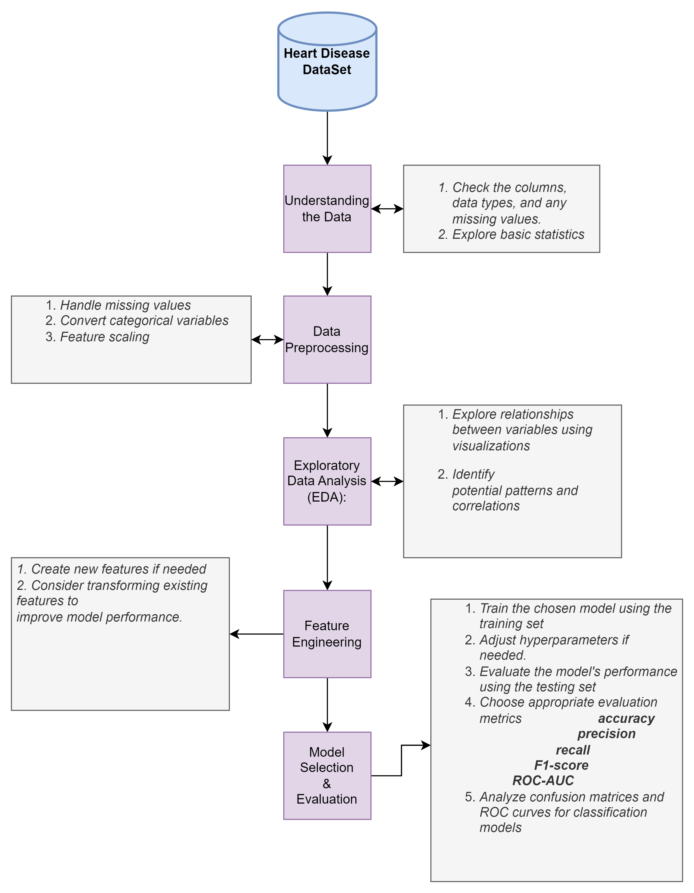

## Heart Disease Indıcators


Heart disease, also known as cardiovascular disease, refers to a class of diseases that involve the heart or blood vessels. Risk factors for heart disease include high blood pressure, high cholesterol levels, smoking, obesity, diabetes, and lots of factors. Therefore, when discussing the importance of heart disease, the focus is usually on factors related to cardiovascular health. This project will analyze indicators and effects.

###  Project Overview
#### About Project
  
 - The purpose of the project is to discover the indicators of heart disease. 
 - Main project file is **HeartDisease.ipynb**
 - The Heart Disease Indıcator project is taken from https://www.kaggle.com/datasets/kamilpytlak/personal-key-indicators-of-heart-disease/data.
 - The dataset originally comes from the CDC and is a major part of the Behavioral Risk Factor Surveillance System (BRFSS), which conducts annual telephone surveys to collect data on the health status of U.S. residents. As described by the CDC: "Established in 1984 with 15 states, BRFSS now collects data in all 50 states, the District of Columbia, and three U.S. territories. BRFSS completes more than 400,000 adult interviews each year, making it the world's largest continuously conducted health survey system.
 - The dataset has, which includes 40 features and 445132 columns.
 -  Our target variable is HadHeartAttack. This object variable has 2 conditions Yes or No. 
 - Additionally, this project provides the foundation for building and evaluating a machine-learning model for heart disease.

 #### Project Flow Chart
 
 
 ### Recomendations for Heart Healthy

 1. About General Health
 
Adopting a healthy lifestyle, including regular exercise and stress management, is crucial for preventing heart disease and improving both physical and mental well-being. 

2. Smoking

Smoking is a well-established and significant risk factor for the development of heart disease. Atherosclerosis,Coronary Artery Disease,Blood Clotting, Hypertension ,Reduced Oxygen Supply. Quitting smoking is one of the most effective ways to reduce the risk of heart disease. 

3. General Physical Health Disease 

 General physical health is intricately connected to heart health. In this project, HadAngina and HadArthritis is relatively most depence on the heart disease.

4. Vaccine 

Vaccine usage so important but the works are show that some poeple which is vaccinated have heart disease. So we should be careful. In this project;FluVaxLast12 , PneumoVaxEver and Tetanus is shining.

5. Sleep

Aim for 7-9 hours of quality sleep each night.
Establish a consistent sleep routine and create a sleep-friendly environment.

6. Regular Health Check-ups

Schedule regular check-ups with your healthcare provider to monitor blood pressure, cholesterol levels, and other key indicators.
Follow recommended screenings for heart disease risk factors.

7. Balanced Diet

Eat a variety of fruits, vegetables, whole grains, and lean proteins.
Limit saturated and trans fats, cholesterol, sodium, and added sugars.
Choose heart-healthy fats, such as those found in olive oil, avocados, and nuts.

###  How to Use This Repository

 1. **Clone the Repository**: Start by cloning this repository to your local machine using `git clone`.

```bash
git clone https://github.com/nurfkutlu/Heart_disease.git
```
2. **Explore Tutorials and Code Examples**: Browse the `Tutorials` and `Code Examples` directories to learn and experiment with different machine learning concepts. Each folder contains its own README file with instructions.

3. **Practice with Datasets**: If you want to practice on real data, check out the `Datasets` directory for sample datasets that you can use in your machine learning projects.For this dataset kaggle web page is up.

